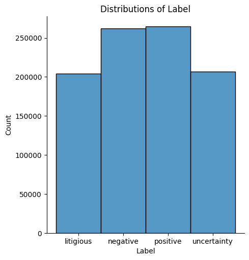
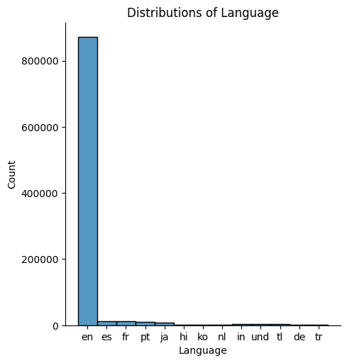
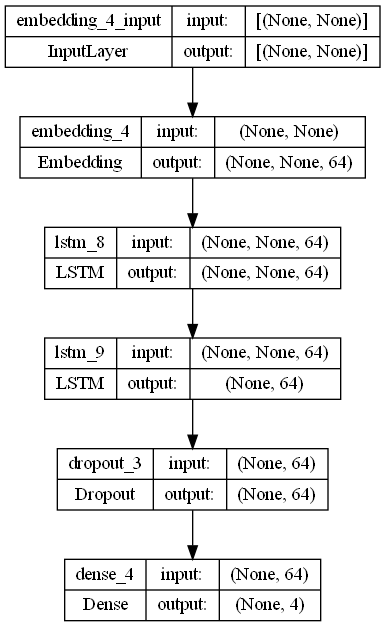
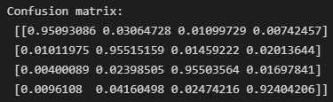
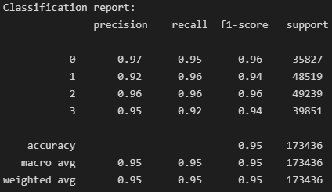

# Sentiment Analysis on Tweets with LSTM
 Using LSTM to do NLP sentiment analysis on Tweets from Twitter.

## Usage
> Download the dataset from [here](https://www.kaggle.com/datasets/tariqsays/sentiment-dataset-with-1-million-tweets) and extract it into the dataset folder.

## Steps taken

Step 1 - Data loading
Step 2 - Data inspection
Step 3 - Data cleaning
Step 4 - Features selection
Step 5 - Data pre-preprocessing
Step 6 - Model development
Step 7 - Model evaluation
Step 8 - Model saving

## Visualization

  

A plot for the label distributions. The label in the dataset is mostly balanced between the 4 values.

 

  

A plot for the language distributions. The data is is mostly made up of tweets in English.

 

  

A plot for the structure of the model. The model consist of an Embedding layer, 2 layers of LSTM, a Dropout layer and a Dense layer as the classifier.

 

  

Confusion matrix from the model's predictions normalized to 1 for easier analysis.

 

  

Classifcation report from the model's predictions. The model scored 95% in accuracy and between 94%-96% in F1-score.

## Acknowledgement
Thanks to [Muhammad Tariq](https://www.kaggle.com/datasets/tariqsays/sentiment-dataset-with-1-million-tweets) from Kaggle for the dataset!
